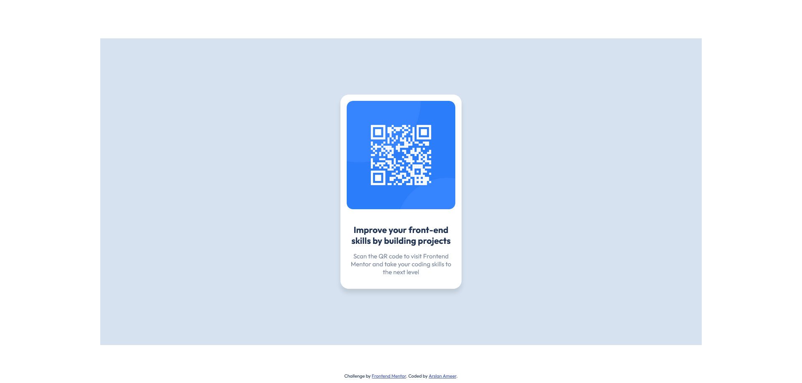

# Frontend Mentor - QR code component solution

This is a solution to the [QR code component challenge on Frontend Mentor](https://www.frontendmentor.io/challenges/qr-code-component-iux_sIO_H). Frontend Mentor challenges help you improve your coding skills by building realistic projects. 

## Table of contents

- [Overview](#overview)
  - [Screenshot](#screenshot)
  - [Links](#links)
- [My process](#my-process)
  - [Built with](#built-with)
  - [Continued development](#continued-development)
- [Author](#author)

## Overview

### Screenshot

### Links

- Solution URL: [GitHub Repo](https://github.com/ArslanAmeer/qr-code-component-challenge)
- Live Site URL: [Live Demo](https://qr-component-challenge-arslan.netlify.app/)

## My process

### Built with

- Semantic HTML5 markup
- SCSS
- CSS custom properties
- Flexbox
- Positioning
- Desktop-First workflow

### Continued development

Looking forward to generate QR code with the help of API and passing the data to the QR code generator.

## Author

- Website - [Arslan Ameer](https://arslanameer.com)
- Frontend Mentor - [@Arslan Ameer](https://www.frontendmentor.io/profile/ArslanAmeer)
- [Twitter](https://www.twitter.com/ThELeGenD_Says)

